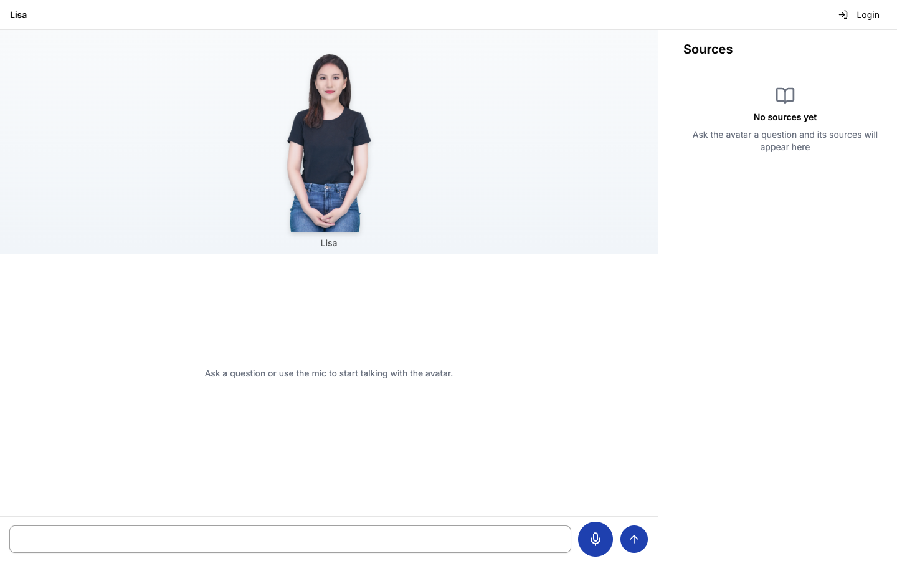
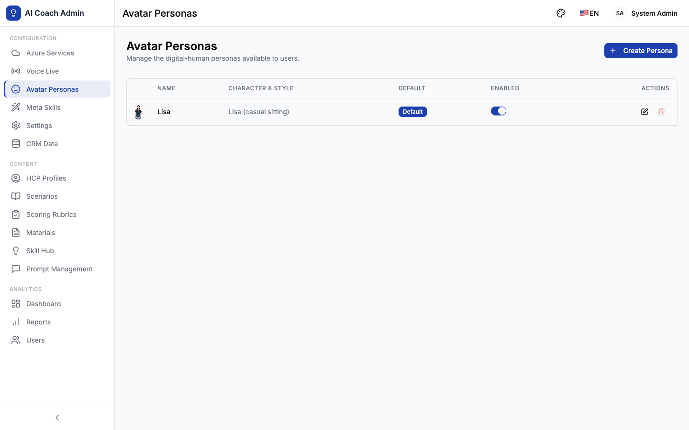

# AI Avatar Platform

<p align="center">
  <strong>AI-Powered Digital Human Avatar Platform</strong><br/>
  <em>基于 Azure AI 的智能数字人 Avatar 平台 — 官网问答 + 登录个性化知识助手</em>
</p>

<p align="center">
  
  
  
  
  
  
</p>

---

## What is AI Avatar Platform?

AI Avatar Platform 是一个基于 **Azure AI Services** 的智能数字人问答平台，通过 **实时语音对话 + 数字人形象 (Avatar)** 提供两种交互模式：

- **匿名模式**（无需登录）：数字人基于官方网站内容知识（已索引至 Azure AI Foundry IQ）回答访客问题，回答附来源文档引用
- **登录模式**（个性化）：数字人基于 CRM 关联的用户画像回答问题（POC 阶段以 Excel 对应关系表模拟，不做真实 CRM 集成），并记住用户偏好（通过 system prompt / prompt template 按 userid 注入）
- **多语言**：支持中文、英文、西班牙语（UI + 数字人语音）
- **清爽 UI**：仅展示数字人形象与来源文档链接，语音内容与文档展示分离呈现

**核心价值**：访客和登录用户都能获得即时、准确、多语言的数字人问答体验 — 匿名用户基于公开官网知识，登录用户则获得基于个人画像与偏好的个性化回答。

---

## Screenshots / 界面预览

<p align="center">
  <strong>匿名数字人问答（默认 Persona 静态形象 + 来源面板）</strong><br/>
  
</p>

<p align="center">
  <strong>管理员数字人 Persona 目录管理</strong><br/>
  
</p>

---

## Key Features / 核心功能

### 匿名问答（ANON — v2.0）

- **免登录直达** — 打开首页 `/` 即可向数字人文字/语音提问，无需任何账号
- **官网知识 grounding** — 回答基于 Azure AI Foundry IQ 索引的官网内容，仅使用授权知识来源
- **来源引用分离展示** — 每个回答附 page + document link，与回答内容作为独立 UI 元素展示（Sources 面板）
- **数字人语音回答** — Azure Voice Live avatar 实时语音（WebRTC），VAD 自动检测
- **限流与滥用防护** — slowapi IP/会话双层限流 + 匿名会话配额 + 交互审计日志

### 登录个性化（PERS — v2.0）

- **Excel CRM 对应关系表** — 管理员上传 Excel（userid → CRM 知识 / 对口支持人），系统解析入库
- **Chat-time 偏好注入** — 登录用户提问时按 userid 将 CRM 上下文与偏好注入 system prompt，含 prompt-injection / PII 双闸 sanitization
- **管理员偏好打标签** — 界面查看/编辑用户偏好标签（人工打标签，POC 不做自动 memory）
- **登录直达 avatar 页** — 普通用户登录后直达 `/` 并加载个人记忆与已记住的 Persona；admin 落 `/admin/dashboard`

### 数字人 Persona（PERSONA — v2.1 / v2.2）

- **Persona 目录管理** — 管理员增删改/启用禁用 Persona：名称、Azure 预置 avatar character+style（Lisa/Harry/Meg/Max 等）、按语言 voice、按语言问候语、persona prompt 片段
- **唯一默认 Persona** — 仅一个启用的 Persona 可标记默认（DB 级 partial unique index 加固）；匿名访客与未选择用户自动使用默认
- **页内切换 + 持久化** — 登录用户在 avatar 页内切换 Persona，选择持久化为 `selected_persona_id`，切换重建 Voice Live 会话并播报问候语
- **全链路保真** — WebRTC session config 携带 persona 的 character/style（视频形象随切换变化）；Voice Live instructions 携带 sanitized persona prompt 片段（语音人格随切换变化）；voice 三级回退链；greeting 按 locale 解析并回退
- **进页即显形象** — 匿名页加载即展示已配置 Persona 的静态形象（独立于麦克风授权/WebRTC 连接结果）

### 多语言（LANG — v2.0）

- **UI 全量三语** — 中文 / 英文 / 西班牙语，locale key-parity 校验保证翻译不缺失
- **数字人多语言语音** — 按 locale 选择 neural voice（含 es-* 声线），语言切换重建会话

---

## Architecture / 系统架构

```
┌─────────────────────────────────────────────────────────────────┐
│                        Frontend (React SPA)                      │
│  React 18 + TypeScript + Vite 6 + Tailwind CSS v4                │
│  TanStack Query v5 | React Router v7 | i18next (zh/en/es)        │
│  Avatar 页: 数字人视图 + 转写 + Sources 面板 + Persona 切换       │
└────────────┬───────────────────────────────┬─────────────────────┘
             │ REST (/public/avatar, /api/v1)│ WebRTC (SDP/ICE)
┌────────────┴───────────────────────────────│─────────────────────┐
│                     Backend (FastAPI ASGI) │                     │
│  Python 3.11+ | SQLAlchemy 2.0 (async) | Alembic | JWT Auth      │
│                                            │                     │
│  ┌──────────────────┐  ┌─────────────────┐ │ ┌────────────────┐  │
│  │ 匿名会话/限流     │  │ Persona 解析     │ │ │ 个性化注入      │  │
│  │ (session+quota)  │  │ (default/选择)   │ │ │ (CRM+偏好+双闸) │  │
│  └──────────────────┘  └─────────────────┘ │ └────────────────┘  │
└────────────┬───────────────────────────────│─────────────────────┘
             │                               │
┌────────────┴───────────────────────────────┴─────────────────────┐
│                      Azure AI Services                            │
│  ┌────────────────┐  ┌────────────────────┐  ┌────────────────┐   │
│  │ AI Foundry IQ  │  │ Voice Live API     │  │ Azure Avatar   │   │
│  │ (官网知识索引)  │  │ (实时语音 WebRTC)   │  │ (数字人视频)    │   │
│  └────────────────┘  └────────────────────┘  └────────────────┘   │
│  ┌────────────────┐  ┌────────────────────┐                       │
│  │ Azure OpenAI   │  │ Azure Speech       │                       │
│  │ (GPT-4o chat)  │  │ (STT/TTS fallback) │                       │
│  └────────────────┘  └────────────────────┘                       │
└──────────────────────────────────────────────────────────────────┘
                         │
                    PostgreSQL (prod) / SQLite (dev)
```

---

## Tech Stack / 技术栈

| 层级 | 技术 | 用途 |
|------|------|------|
| **Frontend** | React 18, TypeScript (strict), Vite 6, Tailwind CSS v4 | 单页应用 (SPA) |
| **Backend** | Python 3.11+, FastAPI, SQLAlchemy 2.0 (async), Alembic | API 服务 |
| **Knowledge** | Azure AI Foundry IQ (agent + 官网内容索引) | 匿名问答 grounding |
| **AI Engine** | Azure OpenAI (GPT-4o) | 对话引擎 |
| **Voice** | Azure Voice Live API (WebRTC), Azure Speech (STT/TTS) | 实时语音交互 |
| **Avatar** | Azure AI Avatar（预置 character+style） | 数字人形象 |
| **Database** | PostgreSQL (prod), SQLite + aiosqlite (dev) | 数据存储 |
| **State Mgmt** | TanStack Query v5 (server state), lightweight auth store | 前端状态 |
| **i18n** | i18next — 中文 / 英文 / 西班牙语，key-parity 校验 | 国际化 |
| **Testing** | pytest + pytest-asyncio, Vitest, Playwright (E2E) | 测试 |
| **Infra** | Docker, Azure Container Apps, GitHub Actions CI/CD | 部署 |

---

## Live Demo

| 服务 | URL |
|------|-----|
| Frontend | https://ai-coach-frontend.mangoforest-104bd67e.eastasia.azurecontainerapps.io |
| Backend API | https://ai-coach-backend.mangoforest-104bd67e.eastasia.azurecontainerapps.io |
| API Docs (Swagger) | https://ai-coach-backend.mangoforest-104bd67e.eastasia.azurecontainerapps.io/docs |

> 每次 push 到 `main` 分支后通过 GitHub Actions 自动部署到 Azure Container Apps。

---

## Quick Start / 快速开始

### Prerequisites

- Python 3.11+, Node.js 20+, Docker (optional)

### Local Development

```bash
# Clone
git clone https://github.com/huqianghui/AI-avatar-vibe-coding.git
cd AI-avatar-vibe-coding

# Backend
cd backend
python3 -m venv .venv && source .venv/bin/activate
pip install -e ".[dev,voice]"
cp .env.example .env          # 配置 Azure AI 服务密钥
python3 scripts/init_db.py
python3 scripts/seed_data.py
uvicorn app.main:app --reload --port 8000

# Frontend (new terminal)
cd frontend
npm ci
npm run dev
# → http://localhost:5173  （首页 `/` 即匿名数字人问答页）
```

### Docker

```bash
docker compose up --build
# Backend:  http://localhost:8000
# Frontend: http://localhost:5173
```

### Default Credentials

| 角色 | 用户名 | 密码 |
|------|--------|------|
| 管理员 | admin | admin123 |
| 用户 | user1 | user123 |
| 用户 | user2 | user123 |
| 用户 | user3 | user123 |

---

## Cloud Deployment / 云端部署

Azure 部署资产位于 `infra\azure\`，入口脚本是：

```powershell
.\infra\azure\scripts\deploy.ps1
```

部署权限、本地工具要求和故障前检查见 [`infra\azure\docs\azure-deployment-permissions-and-tools.md`](infra/azure/docs/azure-deployment-permissions-and-tools.md)。可用配套检查脚本 `infra\azure\scripts\check-azure-deploy-prereqs.ps1` 快速确认 Azure CLI、Bicep、登录账号和可选 RBAC 信息：

```powershell
.\infra\azure\scripts\check-azure-deploy-prereqs.ps1 -CheckAzureRoles
```

部署前先登录并确认订阅：

```powershell
az login
az account show -o table
```

脚本默认使用：

| 配置 | 默认值 |
|---|---|
| 应用/通用资源区域 | `-Location`，默认 `swedencentral` |
| Foundry/AI Services 区域 | 默认跟随 `-Location`，可用 `-FoundryLocation` 单独指定 |
| `EnvironmentName` | `public` |
| `DeploymentMode` | `foundryOnly` |
| `NetworkProfile` | `publicDemo` |
| 数据库认证 | PostgreSQL Entra ID + backend Managed Identity |
| Azure service key 存储 | Key Vault |
| Chat model deployment | Foundry `gpt-4o` |

### 方式一：Public demo 部署

`publicDemo` 是默认网络配置，适合快速 demo、调试和本地直接验证：

```powershell
.\infra\azure\scripts\deploy.ps1 `
  -NetworkProfile publicDemo `
  -ResourceGroupName ai-coach-publicsandbox01-rg `
  -EnvironmentName public `
  -Location eastasia `
  -FoundryLocation eastus2 `
  -DeployApp
```

这个模式下：

- Frontend Container App：public ingress
- Backend Container App：public ingress
- Storage / Key Vault / PostgreSQL / Foundry：保留 public network access
- 本地可以直接访问 backend health/API docs

如果只更新基础设施，不重建应用镜像，可以不传 `-DeployApp`：

```powershell
.\infra\azure\scripts\deploy.ps1 -ResourceGroupName ai-coach-demo-rg
```

### 方式二：Private backend 部署

`privateBackend` 用于更接近生产安全边界的云端验证。应用、数据库、存储、Key Vault、Container Apps、VNet/PE 等通用资源使用 `-Location`；Azure AI Foundry / AI Services / model deployment 可用 `-FoundryLocation` 放到模型可用区域。例如应用资源部署到 East Asia，Foundry 部署到 East US 2：

```powershell
.\infra\azure\scripts\deploy.ps1 `
  -NetworkProfile privateBackend `
  -ResourceGroupName ai-coach-privatesandbox01-rg `
  -EnvironmentName private `
  -Location eastasia `
  -FoundryLocation eastus2 `
  -DeployApp
```

这个模式下：

- Frontend Container App：public ingress，用户从公网访问前端
- Backend Container App：internal ingress，只在 Container Apps Environment / VNet 内访问
- Container Apps Environment：接入 VNet
- Storage Blob、Key Vault、PostgreSQL、Foundry/AIServices：通过 private endpoint 访问
- 这些 private endpoint 覆盖的资源会关闭 public network access
- PostgreSQL 不再创建 `AllowAzureServices` firewall rule
- `foundryOnly` 只管理 Foundry/AIServices 的 `gpt-4o` deployment，不再管理 legacy standalone Azure OpenAI account

如果不传 `-VnetName`，模板会自动创建 VNet 和两个 subnet：

- Container Apps infrastructure subnet
- Private endpoints subnet

`privateBackend` 下本地机器不能直接访问 backend internal URL；验证应通过 public frontend、Container App logs、bootstrap job 状态或 Azure Portal/CLI 查看。

### 常用部署检查

部署前预览：

```powershell
.\infra\azure\scripts\deploy.ps1 `
  -NetworkProfile privateBackend `
  -ResourceGroupName ai-coach-private-rg `
  -WhatIf
```

只构建并更新应用镜像：

```powershell
.\infra\azure\scripts\deploy.ps1 `
  -NetworkProfile privateBackend `
  -ResourceGroupName ai-coach-private-rg `
  -DeployApp
```

`-DeployApp` 使用当前本地 worktree 的 `backend\` 和 `frontend\` 构建 ACR 镜像；部署前请确认当前分支就是要上线验证的代码。

更多 Azure 参数和网络细节见 [`infra\azure\README.md`](infra/azure/README.md)。

---

## API Endpoints

启动后端后访问 Swagger UI: http://localhost:8000/docs

### 匿名公开接口（无需登录，挂载于根路径）

| 端点 | 方法 | 功能描述 |
|------|------|----------|
| `/public/avatar/session` | POST | 签发匿名会话（限流保护） |
| `/public/avatar/chat` | POST | 匿名 grounded 问答（Foundry IQ，回答附来源引用） |
| `/public/avatar/persona` | GET | 当前生效 Persona 身份元数据（进页即显数字人形象） |
| `/public/avatar/webrtc/session` | POST | Voice Live WebRTC 临时凭证（携带 persona character/style/voice/greeting/instructions） |
| `/api/health` | GET | 健康检查 |

### 认证接口（`/api/v1` 前缀，JWT Bearer）

| 模块 | 路径前缀 | 功能描述 |
|------|----------|----------|
| Auth | `/api/v1/auth` | JWT 登录、用户信息 |
| Personalized Avatar | `/api/v1/personalized-avatar` | 登录个性化问答会话（CRM + 偏好注入） |
| Avatar Personas | `/api/v1/avatar-personas` | 启用 Persona 列表（用户侧） |
| Persona Selection | `/api/v1/users/me/persona` | 用户 Persona 选择读取/持久化 |
| Admin: Avatar Personas | `/api/v1/admin/avatar-personas` | Persona 目录 CRUD、启用/禁用、默认标记 |
| Admin: CRM | `/api/v1/admin/crm` | Excel CRM 对应关系表上传/解析 |
| Admin: User Preferences | `/api/v1/admin/user-preferences` | 用户偏好标签查看/编辑 |
| Admin: Public Knowledge | `/api/v1/admin/public-knowledge-config` | 匿名知识库（Foundry IQ agent）配置 |
| Admin: Users | `/api/v1/admin/users` | 用户管理 |
| Config | `/api/v1/config` | 系统配置 / feature flags |
| Azure Config | `/api/v1/azure-config` | Azure AI 服务连接配置 |

> 此外仓库保留 v1.0 教练平台（HCP coaching）的全套 API 与前端代码（sessions/scoring/conference/voice-live 等），其导航入口默认通过 `feature_legacy_coach_nav_enabled` flag 隐藏。

---

## Project Structure

```
AI-avatar-vibe-coding/
├── backend/
│   ├── app/
│   │   ├── api/              # FastAPI routers（public_avatar + /api/v1 各域）
│   │   ├── models/           # SQLAlchemy ORM（persona、匿名会话、CRM、偏好等）
│   │   ├── schemas/          # Pydantic v2 request/response schemas
│   │   ├── services/         # 业务逻辑（persona 解析、sanitization、限流、Voice Live WebRTC）
│   │   └── utils/            # Exceptions, pagination
│   ├── tests/                # pytest 单元/集成测试
│   └── alembic/              # Database migrations
├── frontend/
│   ├── src/
│   │   ├── pages/            # 路由级页面（avatar 首页、admin 管理页等）
│   │   ├── components/
│   │   │   ├── avatar/       # Sources 面板、输入栏、Persona 切换、麦克风对话框
│   │   │   ├── voice/        # AvatarView、转写组件
│   │   │   └── shared/       # 通用 UI 组件
│   │   ├── hooks/            # TanStack Query hooks（匿名/个性化会话、persona）
│   │   └── api/              # 类型化 API 客户端（JWT axios + 匿名 fetch）
│   ├── public/locales/       # i18n 资源（zh-CN / en-US / es-ES / es-MX / es-US）
│   └── e2e/                  # Playwright E2E 测试
├── docs/                     # Requirements, specs, screenshots
├── infra/azure/              # Azure Bicep + 部署脚本
├── .github/workflows/        # CI/CD pipelines
└── CLAUDE.md                 # Engineering handbook
```

---

## Development Roadmap / 开发路线

| 里程碑 | 状态 | 关键交付 |
|--------|------|----------|
| **v1.0** HCP Coach Platform | ✅ 完成 | F2F/会议训练、评分反馈、HCP 角色、Azure 全栈集成（入口现默认隐藏） |
| **v2.0** Avatar MVP | ✅ 完成 | 匿名 grounded 问答 + 来源引用（Phase 32）、Excel CRM 个性化注入（Phase 33）、西班牙语（Phase 34）、清爽 Avatar UI（Phase 35） |
| **v2.1** Persona & 登录体验 | ✅ 完成 | Persona 目录管理与唯一默认（Phase 36）、页内切换持久化、登录直达 avatar 页 |
| **v2.2** Persona 保真与加固 | ✅ 完成 | WebRTC 视频形象随 Persona 切换、语音通道 persona instructions、按语言问候语、DB 级默认唯一约束 + E2E 数据清理（Phase 37） |

后续候选：真实 CRM 集成（替换 Excel POC）、自动偏好抽取（memory 机制）、彻底移除 coach 代码。

---

## CI/CD Pipeline

```
Push/PR → Backend Test → Frontend Test → E2E Test → Deploy (main only)
              │               │              │            │
          Ruff lint       TypeScript      Playwright   Azure Container
          pytest          Vite build      Chromium     Apps (ACR)
```

---

## Documentation

| 文档 | 描述 |
|------|------|
| [CLAUDE.md](CLAUDE.md) | 工程手册 — 编码标准、架构约定、注意事项 |
| [Wiki](../../wiki) | 架构文档、开发者入门、项目路线图 |
| [Requirements](docs/requirements.md) | 业务需求规格说明 |
| [Requirements (中文)](docs/requirements-cn.md) | 业务需求（中文版） |
| [Best Practices](docs/best-practices.md) | 工程模式参考 |

---

## Contributing

请参考 [CLAUDE.md](CLAUDE.md) 中的编码标准和 Pre-Commit Checklist。

```bash
# Backend checks
cd backend && ruff check . && ruff format --check . && pytest -v

# Frontend checks
cd frontend && npx tsc -b && npm run build
```

---

## License

Private — BeiGene Internal Use
